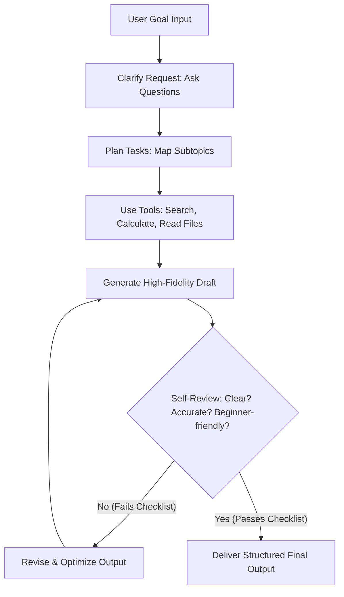

# Lab 10.1 Solution: Understanding AI Agents vs. Agentic AI

This document presents the complete deliverables for Lab 10.1, including the designed prompts, comparison table, workflow diagram, and academic reflections.

---

## 1. Designed Prompts

### Simple Agent Prompt

> **Role:** Summarization Assistant
> **Instruction:**
>
> ```text
> You are a summarization assistant.
> Your task is to summarize any article provided by the user in 5 bullet points.
> ```

### Agentic AI Prompt

> **Role:** Autonomous Research Assistant
> **Instruction:**
>
> ```text
> You are an autonomous research assistant.
> Your goal is to help users understand complex topics.
> Follow this workflow:
> 1. Ask clarifying questions to narrow down the research focus (e.g., target audience, technical depth, budget).
> 2. Create a systematic research plan mapping out key concepts.
> 3. Identify and analyze key subtopics in detail.
> 4. Summarize your findings in a draft.
> 5. Review the summary for clarity, accuracy, completeness, and suitability for beginners.
> 6. Revise the final answer based on the evaluation.
> 7. Format the output with clear headings, subheadings, and bullet points.
>
> Before delivering the final answer, run a self-evaluation checklist:
> - Is the language clear?
> - Are the technical details accurate?
> - Is it beginner-friendly?
> ```

---

## 2. Agent vs. Agentic Comparison

| Feature              | Simple Agent                   | Agentic AI                                             |
| :------------------- | :----------------------------- | :----------------------------------------------------- |
| **Response Style**   | One-step, immediate output     | Multi-step, iterative pipeline                         |
| **Workflow**         | Direct input-to-output mapping | Planning → Ingestion → Execution → Review → Refinement |
| **Self-Correction**  | None (accepts first draft)     | Active review loop and validation checklists           |
| **Clarification**    | None (acts on ambiguous input) | Proactively asks clarifying questions                  |
| **Tool Usage**       | Static or no tools             | Dynamic selection of search, calculator, etc.          |
| **Goal Orientation** | Passive task completion        | Active goal pursuit and adaptive execution             |

---

## 3. Workflow Architecture Diagram



---

## 4. Reflection and Analysis

### Q1: What makes an AI system “agentic”?

An AI system is "agentic" when it is capable of independent, goal-directed behavior rather than simple prompt-response reactions. It acts as an active agent with agency: defining its own sub-tasks, choosing when and how to utilize external tools, maintaining a persistent state or memory, evaluating its own progress against a defined objective, and self-correcting when it encounters failures or errors.

### Q2: What additional capabilities did the Agentic AI have?

- **Clarification:** The agent refused to work blindly, ensuring it aligned with the user's intent first.
- **Planning:** It structured the research into logical phases before executing.
- **Iterative Refinement:** It executed a distinct self-evaluation step, critiquing its own work and rewriting sections that were overly dense or lacked detail.
- **Tool Integration:** It selected and orchestrated external tools (e.g., search, calculators) dynamically to ground its answers in real-world facts.

### Q3: Why is planning important?

Planning prevents early convergence on incorrect or sub-optimal solutions. In complex tasks (like financial analysis or travel planning), a single-step LLM call suffers from cognitive compounding errors—errors in early sentences compound into massive inaccuracies later. A distinct planning phase allows the agent to decompose the goal, gather grounding data, set up sanity-check criteria, and modularize the execution.

### Q4: What risks appear when AI becomes autonomous?

- **Goal Drift / Hallucination Loops:** The agent could get stuck in infinite feedback loops or wander away from the original user intention.
- **Runaway Resource Consumption:** Left unchecked, automated loops can generate massive API or computing costs.
- **Action Verification Failures:** Autonomous agents executing terminal commands or modifying codebases can make destructive modifications if verification metrics are poorly designed.

### Q5: Where should humans stay involved?

Humans should operate as the final "gatekeepers" and strategic directors in the workflow (Human-in-the-loop / HITL):

1. **Goal Setting & Constraints:** Defining the high-level boundaries, budget caps, and objectives.
2. **Clarification Checkpoints:** Answering key structural questions raised by the agent.
3. **Critical Approvals:** Reviewing and signing off on implementation plans before execution begins (e.g., deploying code or executing financial actions).
4. **Boundary Definitions:** Restricting execution parameters through rigorous local system settings.
