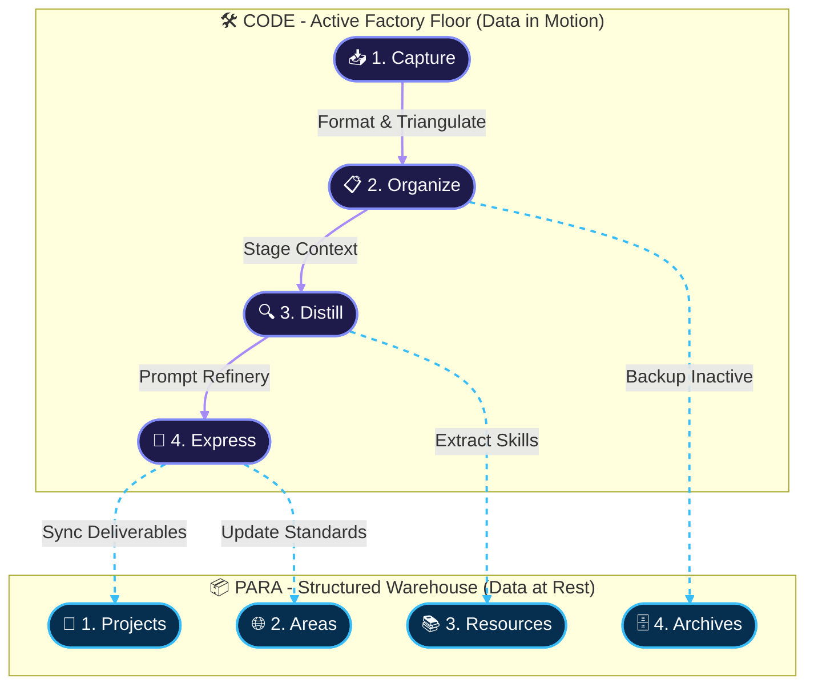
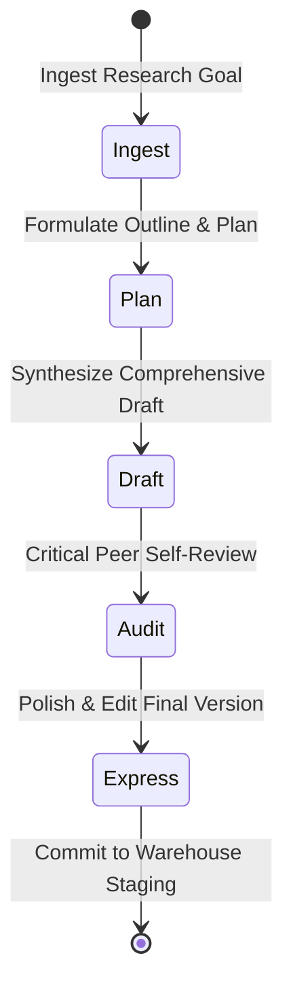

# 🧠 Lapaki: Second Brain & Autonomous Swarm Playground

Lapaki is a production-grade, highly polished cognitive dashboard and local-first execution environment built on the **Google Gemini 2.5 Live Stack**. It integrates a **Bipartite Workspace Architecture** (partitioning active "factory floor" operations from structured "warehouse" long-term assets) with interactive AI playgrounds and a multi-agent travel planning swarm.

The entire application is fully optimized for **Mobile Native, Tablet Native, and Desktop Native viewports**, utilizing fluid typography scaling, touch-safe tap targets ($\ge$ 48px), and dynamic layout refactoring (including horizontal-to-vertical timeline transitions for narrow screens).

---

## 🗺️ System Architecture

Lapaki splits memory and operations into a **Bipartite Workspace** following the **PARA** (Projects, Areas, Resources, Archives) and **CODE** (Capture, Organize, Distill, Express) methodology.

### Bipartite Data & Cognitive Flow (Node Graph Topology)

This high-fidelity node topology graph illustrates how information flows from untrusted, raw inputs into the active factory floor (`CODE/`), undergoes synthesis, and is securely archived in the long-term warehouse (`PARA/`).



---

## 🧪 Interactive Agentic AI Playgrounds (Lab 1)

Lab 1 allows real-time execution and comparison between **Standard Reactive Assistants** and multi-stage, self-correcting **Agentic AI Pipelines**.

### Agentic AI Reasoning Chain

The Agentic AI model conducts a structured, 5-stage reasoning sequence, dynamically lighting up status indicators with glowing neon progress markers.



---

## ✈️ Multi-Agent Swarm Travel Pipeline (Lab 2)

Lab 2 implements an **Autonomous Multi-Agent Swarm** utilizing the **Gemini 2.5 Flash API**. By distributing complex travel planning tasks among specialized roles, the swarm aggregates live estimates, drafts detailed itineraries, and audits budgets.

### Swarm Execution & Telemetry Sequence (Swimlane Flow)

The sequence below details the parallel communication, live prompt setting overrides, and sequential telemetry passing among the swarm agents.

```mermaid
sequenceDiagram
    autonumber
    actor User as 👤 Teacher / Classmate
    participant Ingestion as 📥 Ingestion Agent
    participant Logistics as ✈️ Logistics Agent (Gemini)
    participant Guide as 🗺️ Local Guide Agent (Gemini)
    participant Budget as ⚖️ Budget Accountant Agent (Gemini)
    participant Console as 💻 UI Console & Storage

    User->>Ingestion: Inputs Travel Goal (Dest, Budget, Style)
    Note over User,Ingestion: Pacing control manages delay or instant async execution.
    Ingestion->>Console: Log: Travel task ticket ingested
    
    rect rgb(30, 27, 75)
        Note right of Logistics: Logistics Agent analyzes flights, transit, and lodging.
        Ingestion->>Logistics: Pass Parameters & Logistics System Prompt Override
        Logistics-->>Console: Stream: Flight, hotel, and transit estimates (JSON)
    end
    
    rect rgb(6, 47, 79)
        Note right of Guide: Local Guide Agent writes customized day-by-day itineraries.
        Logistics->>Guide: Pass Estimates & Guide System Prompt Override
        Guide-->>Console: Stream: Markdown Itinerary & Sights
    end

    rect rgb(69, 10, 10)
        Note right of Budget: Budget Accountant verifies finances and caps costs.
        Guide->>Budget: Pass Itinerary & Accountant System Prompt Override
        Budget-->>Console: Stream: Financial Audit, Cost Cap Adjustments & Decision (JSON)
    end

    Budget->>Console: Populate Comparative Travel Grid & Output Final Approved Plan
    Console->>User: Display Polished Output & Enable Custom Swarm overrides
```



---

## 📱 Responsive & Device-Native Optimizations

The interface is engineered to adapt dynamically to the constraints of various viewports without losing structural clarity or causing text collisions:

1. **Desktop Native (Viewport > 1024px)**:
   - Utilizes a wide bipartite dashboard grid (`explorer-grid` and `playground-grid`) with side-by-side telemetry columns.
   - Progress trackers are laid out as beautiful horizontal telemetry pipelines.
2. **Tablet Native (481px to 1024px)**:
   - Dashboard layouts stack to single-column blocks to preserve font line-height readability.
   - Textareas and panels use scroll containment (`overflow-y: auto`) to avoid viewport breakage.
3. **Mobile Native (Viewport <= 480px)**:
   - Viewport margins shrink to `1rem` and base typography scales down fluidly using relative `rem`/`em` root configurations (`13.5px`).
   - Interactive buttons, text inputs, selects, and navigation tabs expand to **touch-safe targets of at least 48px height**.
   - **Horizontal-to-Vertical Pipeline Adapter**: Progress timelines automatically transform into a vertical layout. The connector line dynamically changes from horizontal width growth to vertical height growth, resolving label overlaps.

---

## 🛠️ Branch Strategy & Release Lifecycle

To support safe development, rapid prototyping, and production stability, the repository implements a structured 5-branch strategy:

| Branch Name | Type / Stage | Target Audience / Purpose |
| :--- | :--- | :--- |
| `main` | 🚀 **Production Stable** | Live public production-ready build. Aliased to [lapaki-dashboard-six.vercel.app](https://lapaki-dashboard-six.vercel.app). |
| `staging` | 🧪 **Pre-Release Staging** | High-fidelity classroom integration testing and professor audit staging. |
| `develop` | ⚙️ **Swarm Integration** | Active development branch for adding new agents, prompt refineries, and MCP bridges. |
| `prototype` | 💡 **Experimental** | Rapid sandbox environment for testing novel LLM system instructions and raw features. |
| `baseline` | 📐 **Reference Baseline** | Clean static framework template baseline for architectural verification. |

---

## 🚀 Live Deployments & Getting Started

- **Aliased Production Web App**: [https://lapaki-dashboard-six.vercel.app](https://lapaki-dashboard-six.vercel.app)
- **Engineered Core**: Google Gemini 2.5 Flash API with custom JSON extraction filters.

### Running Locally
To launch the Lapaki Second Brain & AI Agent dashboard locally:
```bash
# Clone the repository
git clone https://github.com/HiroyasuDev/Lab_10.git
cd Lab_10

# Start a simple local server
npx serve .
# Or open index.html directly in your preferred mobile, tablet, or desktop browser.
```

---

*Lapaki is built for classrooms, professors, and engineering enthusiasts who want to explore the future of **Agentic UX** and **Multi-Agent Swarm Orchestration**.*
